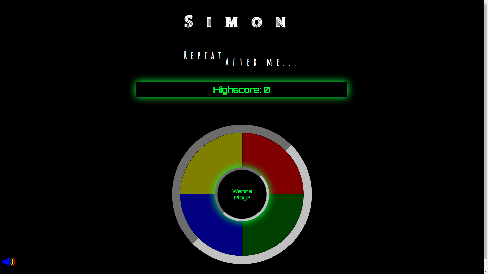

# Simon

This is a web based implementation of Simon, the popular memory game. A series of lights flash on screen, along with a tone, and the player attempts to mimic the pattern. Each level adds a new flash to the sequence, and the speed gradually increases.

## Technologies Used

- HTML: The structure and contents of the game were defined using HTML
- CSS: The styling is provided by CSS, with prominent use of the box-shadow: style to achieve an eerie glow from certain elements, and bright colorful flashes.
- 

